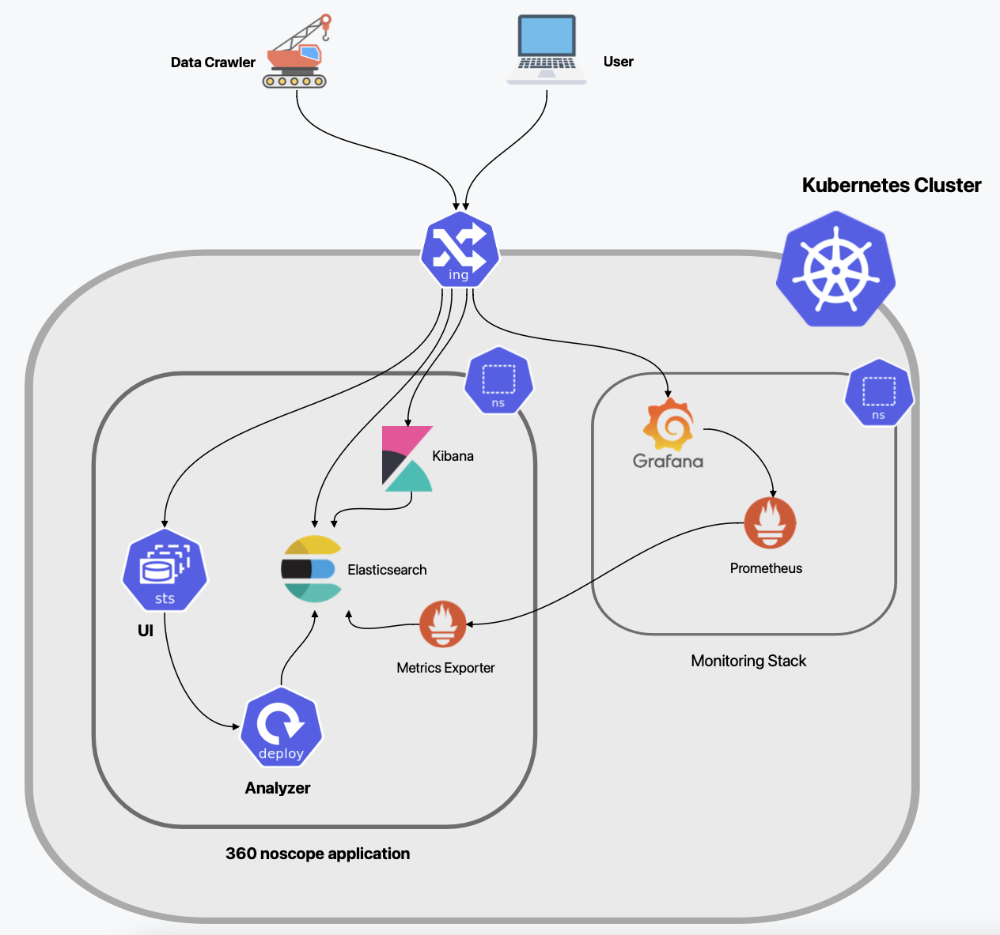
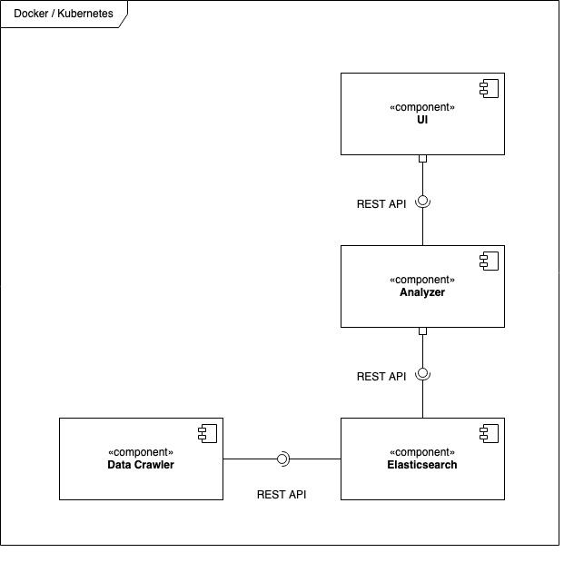

# Architecture

## Component Diagram

### Frontend

The web interface is written in Svelt.

### Backend

Pocketbase

### Analyzer

The analyzer component is written with Java Spring Boot.

### API Documentation

You can find the Swagger API Documentation of the Analyzer component on following URL: http://127.0.0.1:8000/swagger-ui/index.html

### Data persistence

The data is persisted in an [elasticsearch](https://www.elastic.co/elasticsearch/). 
